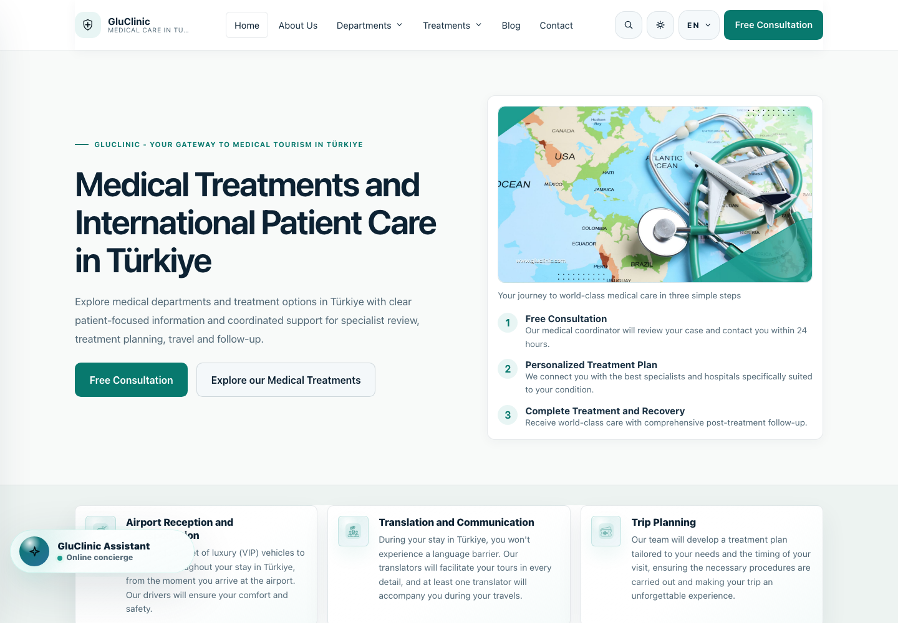
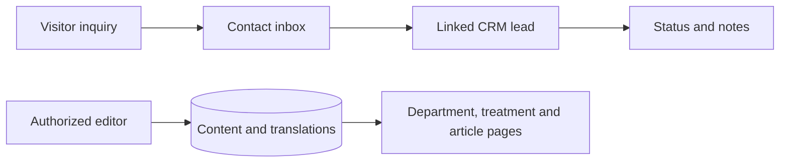
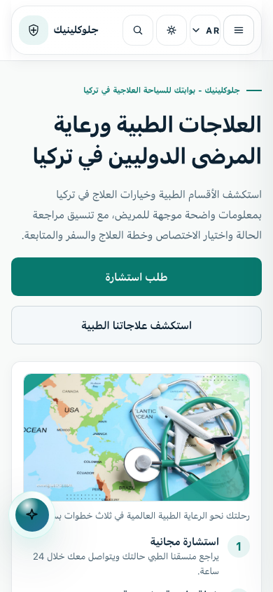
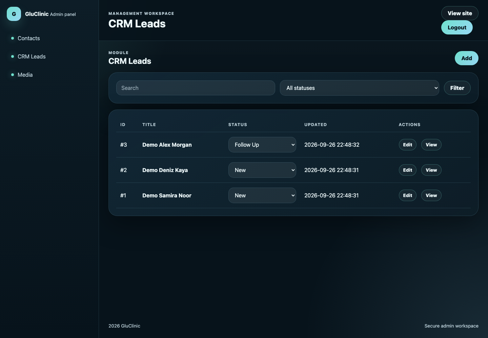
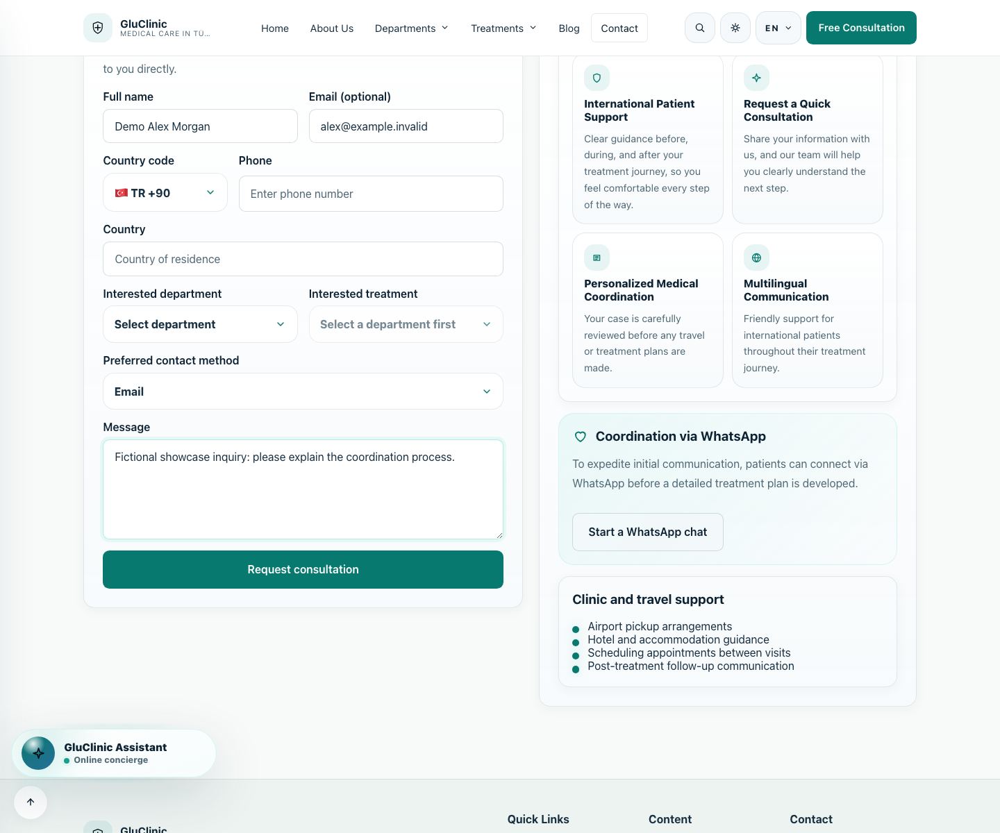
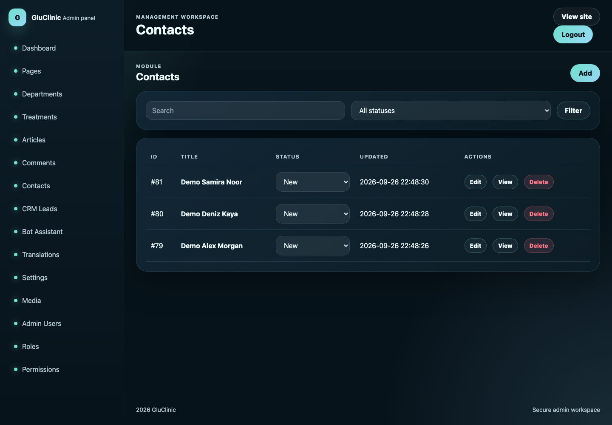
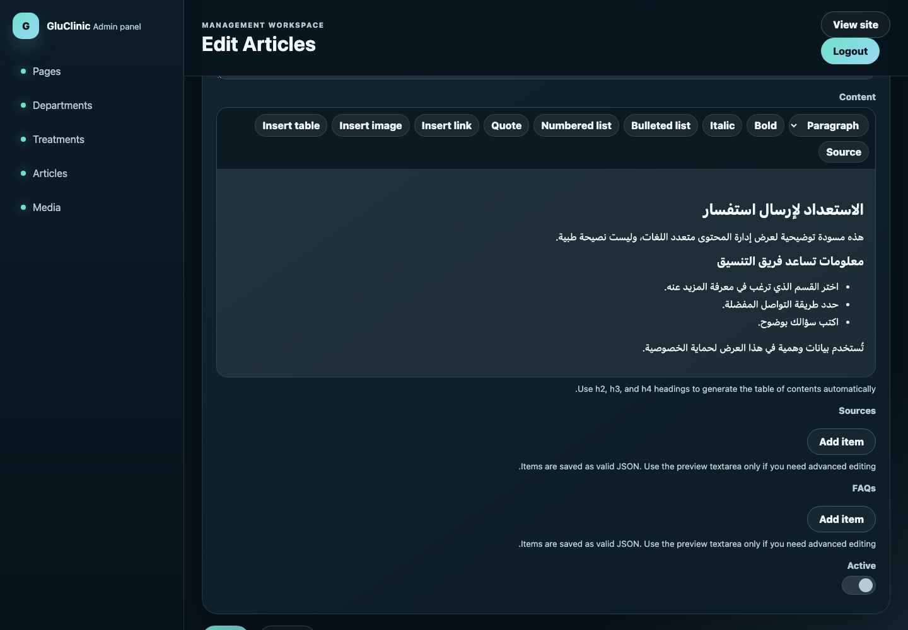
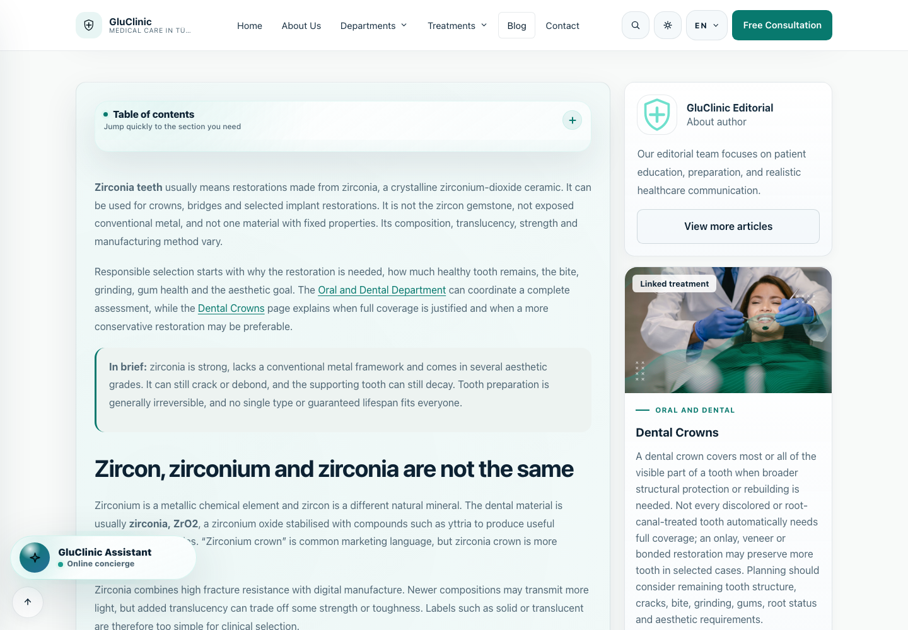

# GluClinic

A four-language medical-information website linked to editorial administration and inquiry follow-up.

This is a documentation and visual showcase. The application source code is not included. Technical descriptions and earlier test results come from the prepared project documentation; those application tests were not repeated for this export.

**Portfolio:** [English](https://ideabat.com/portfolio/gluclinic-medical-tourism-platform/) · [Türkçe](https://ideabat.com/tr/portfolio/gluclinic-medical-tourism-platform/) · [العربية](https://ideabat.com/ar/portfolio/gluclinic-medical-tourism-platform/)

**Case study:** [English](https://ideabat.com/case-study/gluclinic-patient-lead-coordination/) · [Türkçe](https://ideabat.com/tr/case-study/gluclinic-patient-lead-coordination/) · [العربية](https://ideabat.com/ar/case-study/gluclinic-patient-lead-coordination/)

## Ragıp Mullamusa’s contribution

I developed GluClinic’s public website and administration workspace through Ideabat. My work spans PHP/PDO data flows, relational content and inquiry models, localization, SEO URL generation, browser interactions and operational forms. GluClinic is separately owned; it is not an Ideabat SaaS product. No sole ownership, clinical responsibility or maintenance contract is implied.

## At a glance

| Area | Scope |
|---|---|
| Public experience | Departments, treatments, articles, search and inquiry forms |
| Internal experience | Localized publishing, contact inbox, linked CRM leads and notes |
| Stack | PHP/PDO, MySQL-compatible SQL, Apache, HTML/CSS and vanilla JavaScript |
| Languages | English, Arabic, Turkish and French public content |
| Presentation | Responsive web, Arabic RTL, light/dark themes |
| Scope boundary | Information and inquiry coordination; no native app or clinical-record system claimed |

## One inquiry, a traceable follow-up

The contact inbox preserves the visitor’s original submission. Converting it to a lead adds an operational record rather than replacing that source. Status and notes then describe staff follow-up. This separates what the visitor supplied from what the team subsequently did.

The conceptual diagram highlights two connected responsibilities: publishing information and coordinating inquiries. Shared relational storage connects each translation to its content identity and each lead to its contact. The configured assistant is a content-guidance flow; it is not presented as a generative medical adviser.

GluClinic serves two connected audiences: visitors exploring medical information and authorized staff maintaining that information and handling inquiries. Ideabat developed the public website and administration workspace as parts of the same web application.

## Context and objective

The software needs to organize departments, treatments and articles across languages, while giving a submitted inquiry a clear destination. These requirements are visible in the implemented workflows. No claim is made about the client's previous tools, response times or business performance.

The delivery objective demonstrated by the application is continuity: related content stays connected, translations stay attached to the correct record, and staff follow-up retains its source inquiry.

## Users and workflow

A visitor can explore related medical content, use search and submit the inquiry form. The application stores the submission in the contact inbox. An authorized administrator can turn it into a CRM lead linked to the original contact, then maintain its status and notes. An editor works in a different set of administration modules to maintain localized content.

For local verification, three fictional inquiries were submitted through the browser and converted into linked leads. A Follow Up status and a note survived reload. This establishes the tested handoff and persistence; it is not a measured customer outcome.

## Architecture and constraints

Apache routes requests into PHP bootstraps, controllers and PDO-backed models. Public templates and the administration interface share the relational database while using separate session and permission handling. Content tables connect to language-specific records for titles, slugs, metadata and bodies. Contacts, CRM leads and notes have explicit links.

The frontend stays server-rendered, using HTML, CSS and vanilla JavaScript. No separate native application was found. A web manifest exists, but native release, installation and offline support were not verified.

## Localization as an editorial workflow

English, Arabic, Turkish and French are implemented public languages. Arabic affects navigation, layout direction and content editing. The showcase includes actual Arabic mobile web, not a mirrored image. The admin capture uses an English shell with Arabic RTL content.

The editor role created an inactive English/Arabic draft and reloaded its saved content. Language-specific records preserve the relationship between a shared article and each translation. Shared SEO helpers use translated route context for canonicals, alternates and sitemaps; no ranking improvement is asserted.

## UX and operational decisions

Department/treatment relationships and an article table of contents organize long-form information. Public light/dark controls are implemented. Role-specific navigation focuses the editorial and CRM workspaces on their assigned modules. The targeted permission check returned 403 when an editor requested user administration; this is not an exhaustive authorization assessment.

## Integration boundaries

The assistant uses configured database flows and translated options, not a demonstrated generative AI provider. The exercised inquiry path writes to SQL. External contact links exist, but the local browser blocked outbound requests and no message, call, payment or booking was completed. Turkish/French assistant flows are absent from the supplied content.

## Delivered capabilities and verification

The evidence supports multilingual content discovery, inquiry persistence, linked CRM follow-up and localized editorial saves. Screenshots show the current local checkout with fictional operational data. The deployed revision, business metrics and launch dates are not established by these captures.

GluClinic is a separately owned project developed by Ideabat. [Visit the public website](https://gluclinic.com). To connect your own public interface and internal workflow, [speak with Ideabat](https://ideabat.com).

## Screen walkthrough

These real application captures come from the project’s prepared publication material. Demonstration records are synthetic; a screen illustrates the interface, not a production deployment or a permission test.

### 01 — GluClinic public homepage

### 02 — Arabic mobile web homepage

### 03 — CRM-agent queue with fictional records

### 04 — Fictional inquiry form

### 05 — The resulting administration inbox

### 06 — Saved Arabic editorial draft

### 07 — Article reading layout

## Evidence and availability

Implementation and historical validation descriptions above are supported by the project’s prepared documentation. The application tests were not rerun for this documentation export. The screenshots demonstrate the captured version, not current service availability, customer adoption or measured commercial outcomes.

## Ownership and technical review

This repository contains documentation and approved visual material, not an application source release. Presentation through Ideabat does not transfer a client’s ownership. For employment, collaboration or technical-review inquiries, contact Ragıp Mullamusa through Ideabat. Access to client-owned source requires prior permission from the project owner and compliance with applicable confidentiality requirements. Requests are reviewed individually; source access is not guaranteed. No software license or redistribution permission is granted by this showcase.

## Contact

Ragıp Mullamusa is the founder of [Ideabat](https://ideabat.com/). For relevant engineering, employment or collaboration inquiries, use [the contact page](https://ideabat.com/contact-us/) or [info@ideabat.com](mailto:info@ideabat.com).
